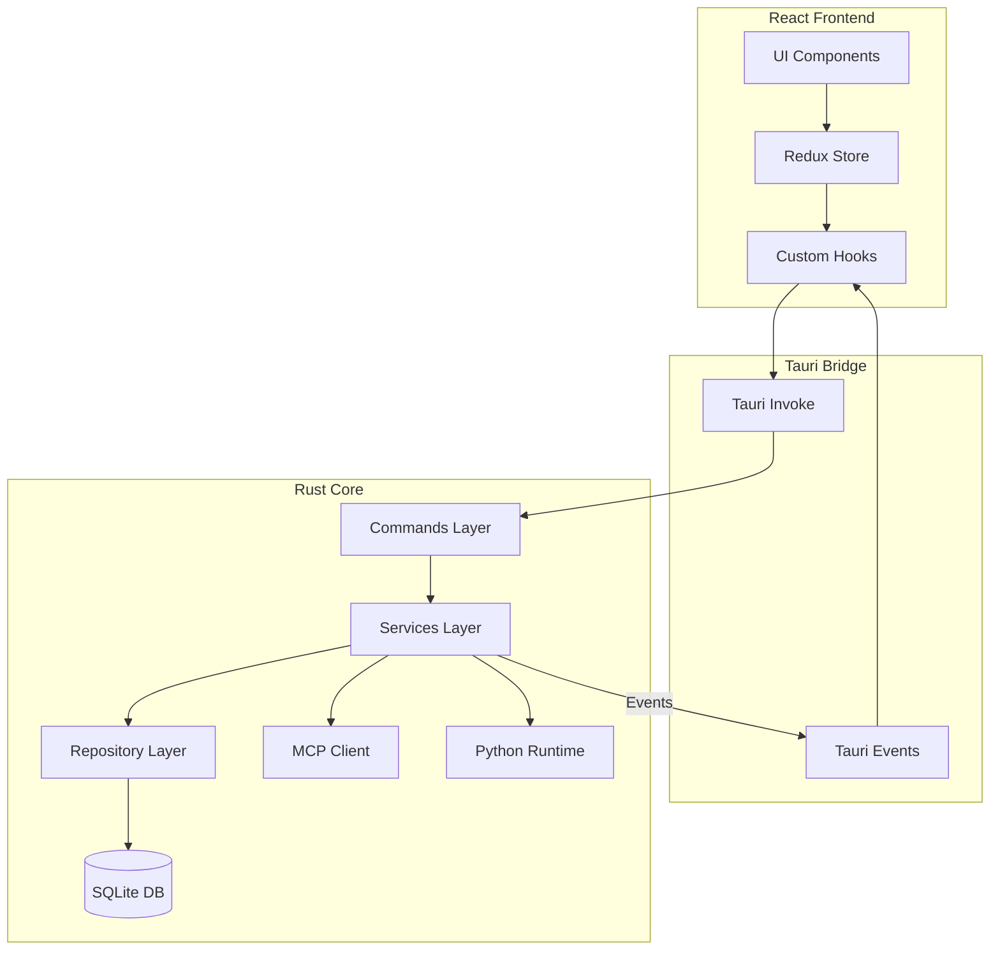

# System Architecture

## High-Level Overview

Nexo follows a **local-first, hybrid architecture** combining a React frontend with a Rust backend, communicating via the Tauri Inter-Process Communication (IPC) bridge.

## Data Flow Patterns

### 1. Request/Response (Commands)

The primary method of communication is the Frontend invoking a Backend Command.

1.  **User Action**: User clicks "Send Message".
2.  **Frontend**: `useChat` hook calls `invoke('send_message', { ... })`.
3.  **Command**: `fn send_message` receives the payload.
4.  **Service**: `MessageService` validates logic, calls `LLMService`.
5.  **Repository**: `MessageRepository` saves the user message to SQLite.
6.  **Response**: Command returns `Result<Message, Error>` to frontend.

### 2. Streaming & Events

For long-running AI generation, we use events.

1.  **Frontend**: Subscribes to `message-stream` event.
2.  **Backend**: `LLMService` receives stream from Provider (OpenAI/Anthropic).
3.  **Event**: Backend emits `message-stream` event for each chunk.
4.  **Frontend**: Event listener updates Redux state, re-rendering the UI in real-time.

## Component Responsibilities

### Frontend (`src/`)

- **Presentation**: Rendering UI, handling user input.
- **State**: Managing temporary UI state and cached server data (Redux).
- **Routing**: Internal app navigation.

### Backend (`src-tauri/`)

- **Business Logic**: All core application logic lives here.
- **Persistence**: SQLite database management.
- **Integration**: Communicating with 3rd party APIs (LLMs) and MCP Servers.
- **Security**: Sandboxing file access and runtime execution.

## Critical Subsystems

### The Agentic Core

Nexo isn't just a chat app; it's an agentic platform.

- **MCP Integration**: Uses `rust-mcp-sdk` to discover and invoke tools.
- **Runtime Envs**: Manages isolated Python/Node environments for code execution tools.

### Database Schema

We use `rusqlite` with bundled SQLite. Migrations are strictly versioned.

- **Workspaces**: Isolated groups of chats/settings.
- **Chats**: Threads of conversation.
- **Messages**: Individual nodes in the conversation tree.
