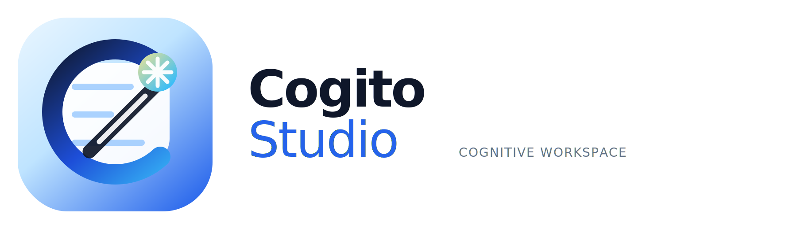

<p align="center">
  
</p>

<h1 align="center">Cogito Studio</h1>

<p align="center">
  A local-first, cross-platform AI workspace for people who want more than a chat box.
</p>

<p align="center">
  Use OpenAI, Anthropic, Google Gemini, Ollama, OpenRouter, Groq, and other providers in one desktop app.
  Connect MCP tools, keep control of your data, and build workflows that fit the way you work.
</p>

<div align="center">

[](https://github.com/CogitoForge-AI/cogito-studio/actions/workflows/build.yaml)
[](https://opensource.org/licenses/MIT)

</div>

<p align="center">
  <a href="https://studio.cogito-ai.org">Website</a>
  ·
  <a href="https://github.com/CogitoForge-AI/cogito-studio/releases">Downloads</a>
  ·
  <a href="https://github.com/CogitoForge-AI/cogito-studio/issues">Report an issue</a>
  ·
  <a href="https://github.com/CogitoForge-AI/cogito-studio">Star on GitHub</a>
</p>

## Why Cogito Studio

Most AI desktop apps force you into a single provider, a hosted subscription, or a narrow chat-only experience.
Cogito Studio takes a different path:

- **Bring your own models** with support for major hosted and local providers.
- **Stay in control** with local storage and your own API keys.
- **Extend the app** with MCP servers and custom tools.
- **Work in one place** with chat, notes, browser experiences, and file artifacts.
- **Avoid lock-in** so you can change providers as pricing, quality, and latency evolve.

## What You Can Do

- Connect multiple LLM providers in one desktop workspace.
- Use hosted and local model backends depending on your budget, privacy needs, or latency targets.
- Attach MCP servers to give the assistant access to tools, APIs, files, and external systems.
- Generate standalone artifacts and preview them inside the app.
- Work with rich Markdown, code blocks, math rendering, and HTML-based outputs.
- Use built-in workspace features like notes, browser flows, and provider-level settings.
- Keep conversations and app data stored locally instead of relying on a mandatory cloud account.

## Supported Providers

Cogito Studio currently includes first-class setup paths for:

- OpenAI
- Anthropic Claude
- Google Gemini
- Ollama
- vLLM
- LiteLLM
- OpenRouter
- Groq
- Together AI
- Fireworks AI
- DeepInfra
- OpenAI-compatible endpoints such as custom gateways or self-hosted services

That gives users the freedom to compare model quality, cost, speed, and privacy without switching apps.

## Who It Is For

Cogito Studio is especially useful for:

- Developers who test prompts and tools across multiple model providers
- Power users who want a serious desktop AI workspace instead of a simple web chat
- Researchers and technical writers who work with Markdown, notes, and structured outputs
- Builders experimenting with MCP and custom tool integrations
- Teams that want flexibility without committing to a single AI vendor

## Quick Start

1. Install Cogito Studio for your platform.
2. Add an API key for a hosted provider, or connect a local provider like Ollama.
3. Start a conversation and switch between providers as needed.
4. Connect MCP servers to unlock external tools and workflow automation.
5. Create artifacts, notes, and browser-assisted flows inside the same workspace.

## Installation

### macOS

```bash
bash <(curl -fsSL https://studio.cogito-ai.org/installer.sh)
```

### Linux

```bash
bash <(curl -fsSL https://studio.cogito-ai.org/installer.sh)
```

### Windows

```powershell
& ([ScriptBlock]::Create((iwr -useb https://studio.cogito-ai.org/installer-windows.ps1)))
```

You can also download packaged releases from the [GitHub Releases page](https://github.com/CogitoForge-AI/cogito-studio/releases).

## Screenshots

### Multi-provider workspace


### Scientific and technical Markdown rendering


### Visual and HTML artifact workflow


## Why Users Star Projects Like This

People usually star projects when they want to:

- Follow product progress and upcoming releases
- Support a strong open-source alternative in the AI tools space
- Bookmark a project they expect to try later
- Signal interest in privacy-first, local-first, and vendor-neutral tooling

If Cogito Studio fits that direction for you, a star helps more people discover the project.

## Local-First by Design

Cogito Studio is built for users who care about ownership and control:

- Your conversations are stored locally
- You bring your own provider credentials
- You can use local model backends where appropriate
- You can extend capabilities through MCP instead of waiting for a closed platform roadmap

## Contributing

Contributions are welcome.
If you want to improve the app, add integrations, refine the UX, or help stabilize cross-platform behavior, start here:

- [Contributing Guide](CONTRIBUTING.md)
- [Development Guide](DEVELOPMENT.md)
- [Issues](https://github.com/CogitoForge-AI/cogito-studio/issues)

## License

Cogito Studio is released under the [MIT License](LICENSE).
